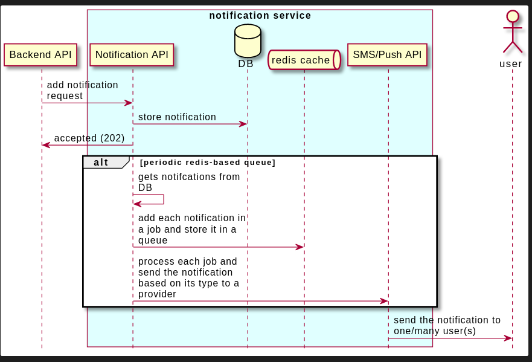

## Prerequisites

#### Docker & Docker-Compose Setup:

- Docker installation: https://docs.docker.com/get-docker/.
- Docker-compose installation: https://docs.docker.com/compose/install/.

## How to run

- run docker compose:
   ```
   docker-compose -d up
   ```

- The service is now up and running on ***localhost:3003***

- Add notifications through `POST localhost:3003/notifications`
   - the scripts in /data directory could be used to send requests. 

- run `docker logs notification-service --follow` to see the result as it will be printed on the console

## Tests

```bash
# unit tests
yarn test

# test coverage
yarn test:cov
```

## Diagrams



## Technical Workflow

- Notification api receives a request to add a notification. This request is received from different other SWVL backend services. 

- The request body holds the following data:
  
   ```javascript
   {   
    "type": "single", // this could be single or group
    "body": "second notification",
    "title": "notification title",
    "delivery_method": "push", // this either push, sms or any other provider
    "priority": 2,  // 1 most important, 5 least important
    "recipients": ["user1_id", "user2_id"] // userId of the recepient to get its data
   }
   ```

- The notification is added to the database then 202 status code response is sent back with notification id

- When the application starts the following runs:
  - **sms_notification** & **push_notification** queues are added
  -  a cron task runs every 1 sec to perform the following:
      - Get all notifications with sent = false from database 
      - Add each notification to a background job in in one of the queues **sms_notification** & **push_notification** based on its `delivery_method`. The job is added to redis cache
      - Consume the job by sending the notification data to the appropriate provider. 
      - Once the job is completed, the notification is marked as sent = true
      - In the provider, either send the notification to a user, or to group of users based on notification type

- Points to consider:
  - The **sms_notification** & **push_notification** queues are configured to rate limit the jobs processed
     - based on the above point, we can control the flow of the notifications sent to the provider (sms/push)
  - we can control each job re-attempts, delete each job after completion of not, and so many options
  - visit `GET localhost:8081` for redis UI
  - visit `GET localhost:3003/admin/queues` for UI for queues and jobs


## Configuration

- The following configuration variables can be passed: 
   - PORT 
   - MONGO_URL
   - REDIS_URL
   - SMS_PROVIDER_NOTIFICATION_LIMIT_PER_TIME
     - the limit of sent notification to sms provider per certain duration
   - SMS_PROVIDER_NOTIFICATION_TIME
     - the duration in milliseconds in which we limit the number of notifications sent to a sms provider 
   - PUSH_PROVIDER_NOTIFICATION_LIMIT_PER_TIME
   - PUSH_PROVIDER_NOTIFICATION_TIME

## OpenAPI Definitions

- hit `GET localhost:3003/api` to view the swagger definitions of this res api

## Microservices' communications

- Other SWVL microservices (location, promotions, etc..) would contact the notifications service to send a notification as follows:
   - Http request like what demonestrated in the current implementation
   - Event driven message brokers (rabbitMQ, kafka, etc..) 
- Since all communications with the notifications service done asyncronously, it is better to use event driven message brokders.

## Future improvements

- Implement how this microservice would get the users data. This could be done by one of the following methods:
    - first method: Whenever a user is added in users microservice, 
    it publishes a message with the added users' data, and
    notifications service subscribe to the this queue to receive
    the user data.Then it stores what it needs in a users table
    - second method: before sending a notification, notifications service
    sends http request to users service to get the needed data to send the notification